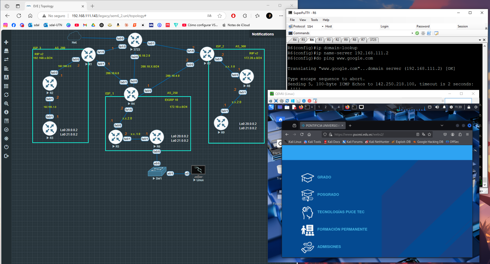

# Topología BGP con RIP, EIGRP y NAT (BGP Topology with RIP, EIGRP and NAT)

Red simulada en EVE-NG con múltiples AS (AS200, AS250 y AS300), cada uno con protocolos IGP diferentes (OSPF, RIP, EIGRP) e interconectados mediante BGP. Se implementa NAT para brindar salida a Internet desde routers internos.

(Simulated network in EVE-NG with multiple ASes (AS200, AS250, AS300), each using different IGP protocols (OSPF, RIP, EIGRP) and interconnected via BGP. NAT is used to provide Internet access to internal routers.)

## 📌 Tecnologías utilizadas / Technologies Used

- Cisco IOS (EVE-NG)
- BGP, RIP v2, OSPF, EIGRP
- NAT con sobrecarga (PAT) / NAT with Overload
- Redes de loopback y rutas estáticas / Loopback networks and static routes
- DNS, DHCP

## 🖥️ Estructura del proyecto / Project Structure

- `routers/` → Archivos `.cfg` de cada router (router configuration files)
- `diagramas/` → Imagen de la topología (network diagram image)
- `README.md` → Documentación del proyecto (project documentation)

## 🧪 Pruebas recomendadas / Recommended Tests

Desde R8 o R9 / From R8 or R9:

```
ping 8.8.8.8
ping www.google.com
```

Desde cualquier AS / From any AS:

```
show ip bgp
show ip route
```

## 📷 Captura de la topología / Network Diagram

Incluye un diagrama de red que muestra interconexiones entre routers y AS.  
(Contains a network diagram showing the interconnection between routers and ASes.)


## 👨‍💻 Autor / Author

Creado por santsavila
📁 Este repositorio es público solo para consulta y aprendizaje. No se aceptan modificaciones externas.

